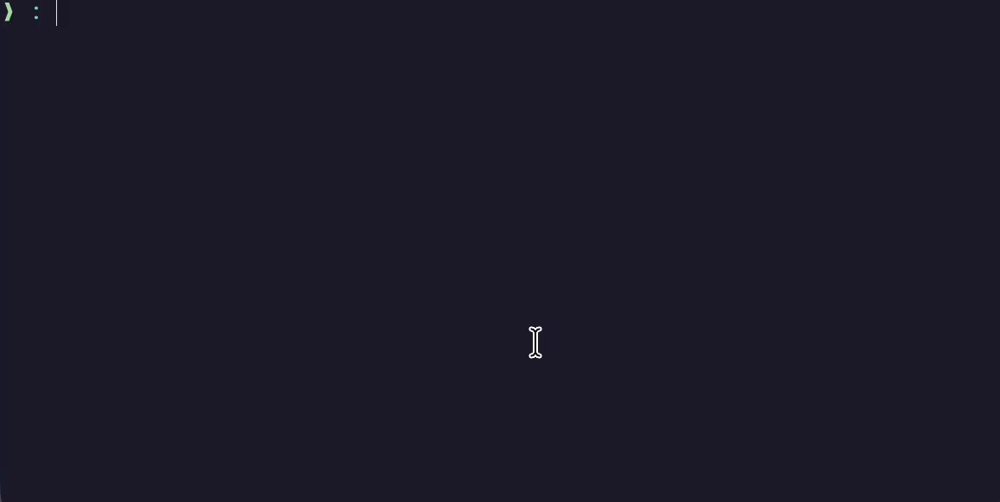

# agentenv


[](LICENSE)

> Project-aware identities for AI coding agents.

`agentenv` automatically launches AI coding agents with the correct project identity.
Keep authentication, configuration, and local agent state isolated per project—so the right account is always used automatically.



```text
project-a ──▶ work-profile     ──▶ isolated HOME
project-b ──▶ oss-profile      ──▶ isolated HOME
project-c ──▶ personal-profile ──▶ isolated HOME
```

## Why agentenv?

Working across client, work, OSS, and personal projects often means different agent accounts, settings, auth tokens, and local state.

`agentenv` maps each project to an isolated profile, then launches your agent with that profile as its `HOME`.

## Features

- Per-project agent profiles
- Isolated `HOME`, `XDG_CONFIG_HOME`, `XDG_DATA_HOME`, and `XDG_STATE_HOME`
- Works with Pi, Claude Code, Codex, and OpenCode
- Optional import from existing agent configs
- Transparent PATH wrappers for direct agent commands
- `doctor` command for debugging setup issues

## Quick start

```sh
agentenv wrap pi
pi
```

First launch opens a profile selector/creator. After that, the project remembers its selected profile.

You can also run agents explicitly:

```sh
agentenv run pi --version
agentenv run --select pi
agentenv run --env DOCKER_CONFIG="$HOME/.docker" sandbox run pi
agentenv run claude
agentenv run codex --help
```

## Install

```sh
curl -fsSL https://raw.githubusercontent.com/flobilosaurus/agent-env/main/install.sh | sh
```

Options:

```sh
AGENTENV_INSTALL_DIR=/usr/local/bin sh -c "$(curl -fsSL https://raw.githubusercontent.com/flobilosaurus/agent-env/main/install.sh)"
AGENTENV_VERSION=v0.1.0 sh -c "$(curl -fsSL https://raw.githubusercontent.com/flobilosaurus/agent-env/main/install.sh)"
```

## Supported agents

| Agent | Config import | Auth import | Notes |
| --- | ---: | ---: | --- |
| Pi | ✅ | ✅ | `.pi/agent` auth, skills, extensions, settings, themes |
| Claude Code | ✅ | partial | macOS Keychain OAuth credentials may require re-auth |
| Codex | ✅ | ✅ | `.codex/config.toml`, auth, skills |
| OpenCode | ✅ | ✅ | XDG config, data, state, plugins, themes |

## Commands

```sh
agentenv run [--select] [--env KEY=VALUE]... <agent> [args...]
agentenv wrap <agent>
agentenv unwrap
agentenv remove [profile]
agentenv doctor [agent]
```

### `run`

`run` is agent-agnostic. It resolves the real executable from `PATH` while skipping the agentenv wrapper bin directory to avoid recursion.

On first use in an unmapped project, it opens a terminal profile selector/creator and stores the local project-to-profile mapping. When creating a profile, you can optionally import supported agent files from your original `HOME` or an existing agentenv profile.

Use `agentenv run --select <agent>` to force the selector even when a mapping already exists. Use repeatable `--env KEY=VALUE` options before `<agent>` to set environment variables for one run. `HOME` cannot be overridden because it provides profile isolation. Arguments after `<agent>` are passed through unchanged.

#### Docker-backed agent runners

Docker stores contexts, credentials, and client configuration under `$HOME/.docker`. Because agentenv replaces `HOME` with the selected profile home, Docker-backed runners such as `sandbox` cannot see the host Docker configuration by default. This may appear as `docker daemon is not running`, especially when using Colima or another non-default Docker context.

Pass the host Docker configuration explicitly. In POSIX shells such as Bash or Zsh:

```sh
agentenv run --env DOCKER_CONFIG="$HOME/.docker" sandbox run pi
```

In Nushell, environment variables use `$env` and interpolated strings use `$"..."`:

```nu
agentenv run --env $"DOCKER_CONFIG=($env.HOME)/.docker" sandbox run pi
```

The shell expands the home path before agentenv starts, so Docker receives the absolute path to the host configuration while the agent still receives its isolated profile `HOME`.

For repeated use, set `DOCKER_CONFIG` in the shell and pass it through. Bash/Zsh:

```sh
export DOCKER_CONFIG="$HOME/.docker"
agentenv run --env DOCKER_CONFIG="$DOCKER_CONFIG" sandbox run pi
```

Nushell:

```nu
$env.DOCKER_CONFIG = ($env.HOME | path join ".docker")
agentenv run --env $"DOCKER_CONFIG=($env.DOCKER_CONFIG)" sandbox run pi
```

### `wrap <agent>`

Writes `$AGENTENV_HOME/bin/<agent>` and updates your shell startup file with an agentenv-managed block that puts that wrapper directory before real agent binaries on `PATH`.

Supported shells/config files:

- `.zshrc`
- `.bashrc`
- `.profile`
- Nushell `env.nu`
- fish `conf.d/agentenv.fish`

Restart your shell or source the updated file before running the agent command directly.

### `unwrap`

Opens an interactive selector for existing agentenv-generated wrappers and deletes the selected wrapper binary from `$AGENTENV_HOME/bin`.

### `remove [profile]`

Deletes the profile from config, removes project mappings that used it, and deletes `$AGENTENV_HOME/profiles/<profile>`. Without a profile argument, it opens an interactive profile selector.

### `doctor [agent]`

Checks config readability, project mapping, profile home paths, wrapper/PATH state, real-agent resolution, and when an agent is provided runs `/resolved/real-agent --version` as a light probe.

## Profile imports

New profile creation can copy top-level groups from:

- Original `HOME` — the shell home before agentenv launches the agent
- Existing profile homes under `$AGENTENV_HOME/profiles/<profile>/home`
- No import

Supported group families include:

- Pi: `.pi/agent/auth.json`, `skills/`, `extensions/`, settings, themes
- Claude Code: `.claude.json` or `.claude/.claude.json` state, `.claude/.credentials.json`, `.claude/settings.json`, agents, skills, commands, hooks
- OpenCode: `.config/opencode/opencode.json`, `tui.json`, agents, plugins, themes, `.local/share/opencode/auth.json`, `.local/state/opencode/` state such as selected TUI theme
- Codex: `.codex/config.toml`, `auth.json`, `skills/`

Imports copy whole selected files/directories before the agent launches. They do not merge contents. If a target path already exists in the new profile, agentenv skips that group, never overwrites it, and reports the skipped path.

## Claude Code notes

When launching `claude`, agentenv sets `CLAUDE_CONFIG_DIR=$HOME/.claude` inside the isolated profile HOME so Claude Code can keep separate account/config state per profile.

Imported legacy `~/.claude.json` state is copied into that config directory as `.claude/.claude.json`.

On macOS, Claude Code stores OAuth credentials in Keychain, so file import cannot transfer the actual login token. Run this once per profile if needed:

```sh
agentenv run claude auth login
```

## XDG isolation

For every launched agent, agentenv sets:

```sh
XDG_CONFIG_HOME=$HOME/.config
XDG_DATA_HOME=$HOME/.local/share
XDG_STATE_HOME=$HOME/.local/state
```

This keeps imported XDG-based config, data, and state inside the isolated profile HOME instead of host XDG directories. This is especially important for OpenCode `tui.json`, themes, auth data, and selected TUI theme state.

## Runtime files

| Path | Meaning |
| --- | --- |
| `${AGENTENV_CONFIG_HOME:-user config dir}/agentenv/config.toml` | Config file |
| `${AGENTENV_HOME:-$HOME/.local/share/agentenv}` | Agentenv data root |
| `$AGENTENV_HOME/bin` | Wrapper bin dir |
| `$AGENTENV_HOME/profiles/<profile>/home` | Isolated profile HOME |

`AGENTENV_HOME` is agentenv's data root. It is not the same as the `HOME` value passed to agents.
